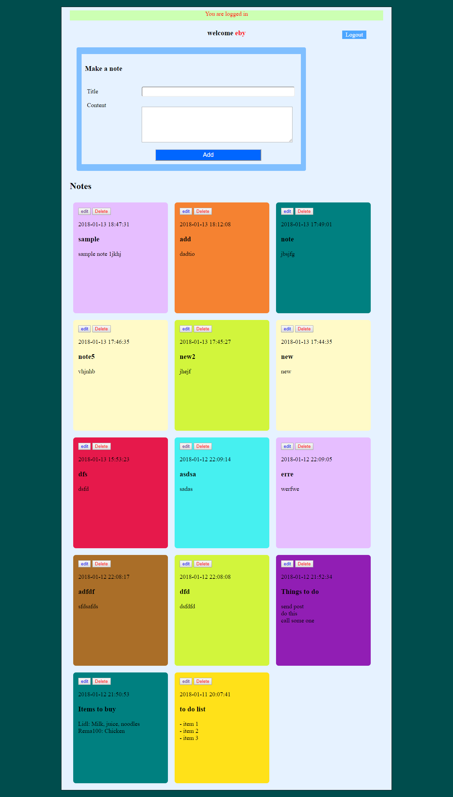

# Notemaker
This is a website for making notes using basic HTML5, CSS3, PHP, Jquery, Ajax. 
Data backend uses mysql database.
# Website functions

## Users 
 Users can register by filling a simple form. Registered users can create, edit and delete notes. 
 Notes are shown in random colurs. When a note is added it added to the list of notes asynchronously using Ajax.
 
 
  